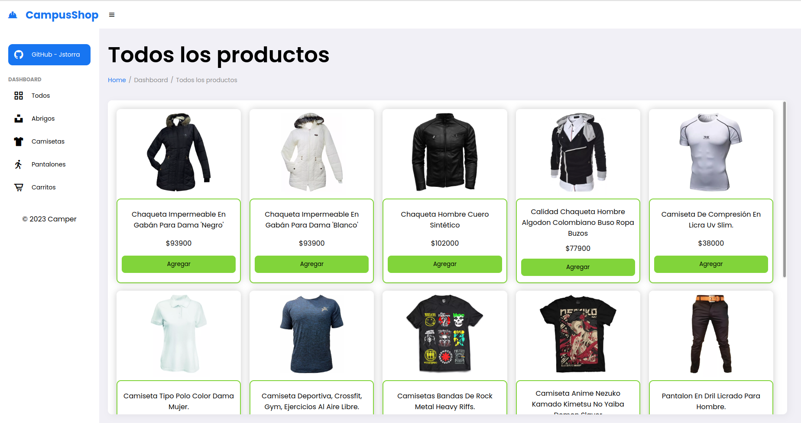
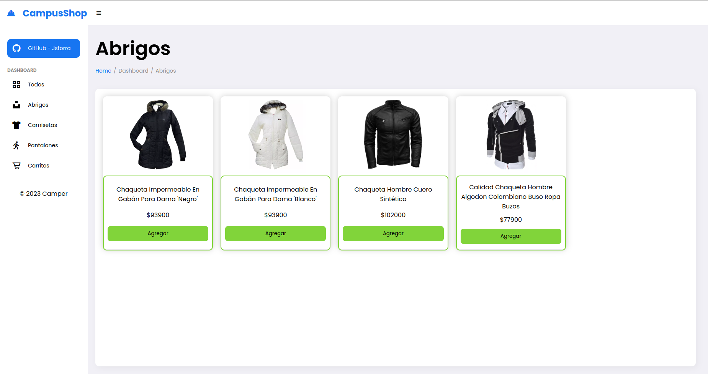
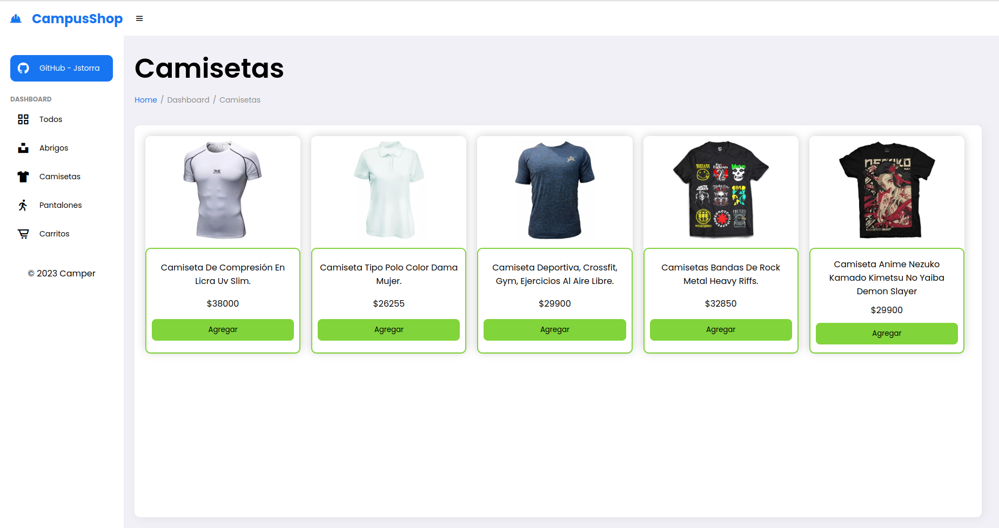
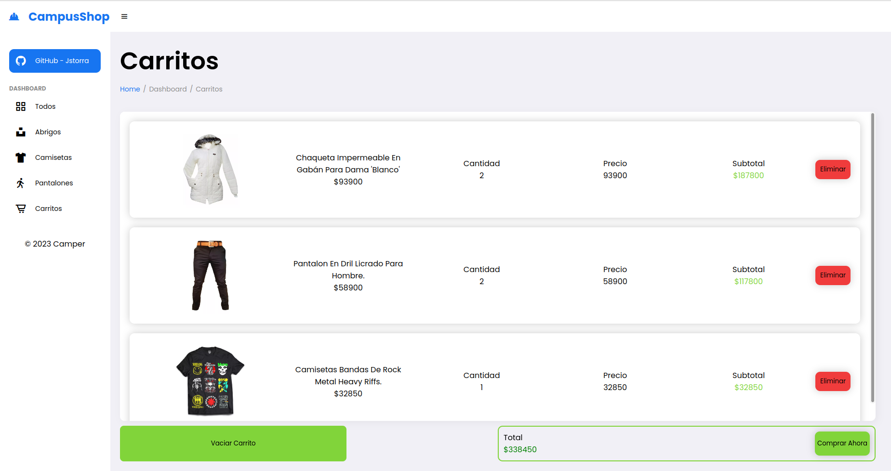

# CampusShop E-commerce

Este proyecto esta basado en una aplicación E-commerce, simulando la funcion de agregar los productos al carrito, mostrar el valor correspondiente de cada producto por su cantidad y el calculo total de toda la compra.

## Secciones

- [Requisitos](#requisitos)
- [Caracteristicas](#caracteristicas)
- [Tecnologias utilizadas](#tecnologias-utilizadas)
- [Como funciona](#como-funciona)
- [Uso App](#uso-app)
- [Screenshots](#screenshots)

## Requisitos

1. Primero que todo debes tener instalado Node en su version **18.18.0**, en caso de no tenerlo instalado descarga la version **LTS** de la pagina oficial https://nodejs.org/es y busca por la version anteriormente mencionada.

2. Una vez instalado asegurate de tener npm incorporado en tu sistema **(al instalar Node por defecto se instala)** para eso puedes abrir la terminal y ejecutar el comando `npm -v`.

3. Tener un entorno de ejecución de código como Visual Studio Code

## Caracteristicas

La aplicación permite:

- Agregar abrigos al carrito de compras
- Agregar camisetas al carrito de compras
- Agregar pantalones al carrito de compras

La aplicación permite visualizar:

- Abrigos disponibles
- Camisetas disponibles
- Pantalones disponibles

## Tecnologias utilizadas

- HTML
- CSS
- JavaScript (ES6)
- Node

## Como funciona

En la pagina principal se encontraran todos los productos registrados y podras agregar al carrito, ademas existen otras 4 paginas dentro de la aplicación para ver los abrigos, camisetas, pantalones y una ultima pagina del carrito de compras donde podras ver todos los pedidos guardados hasta el momento y la suma total a pagar.

## Uso App

1. Clona este repositorio en tu máquina local:

    ```bash
      git clone https://github.com/jstorra/campusShop.git
    ```

2. Ejecuta el comando `npm i` para instalar las dependencias necesarias para el funcionamiento del aplicativo.

3. Ejecuta el comando `npm run dev` para levantar el servidor y guardar los registros en el archivo db.json.

4. Abre el archivo `index.html` en tu navegador web para ver la App en acción.

## Screenshots







---

<p align="center">Developed by <a href="https://github.com/jstorra" target="_blank">@jstorra</a></p>
